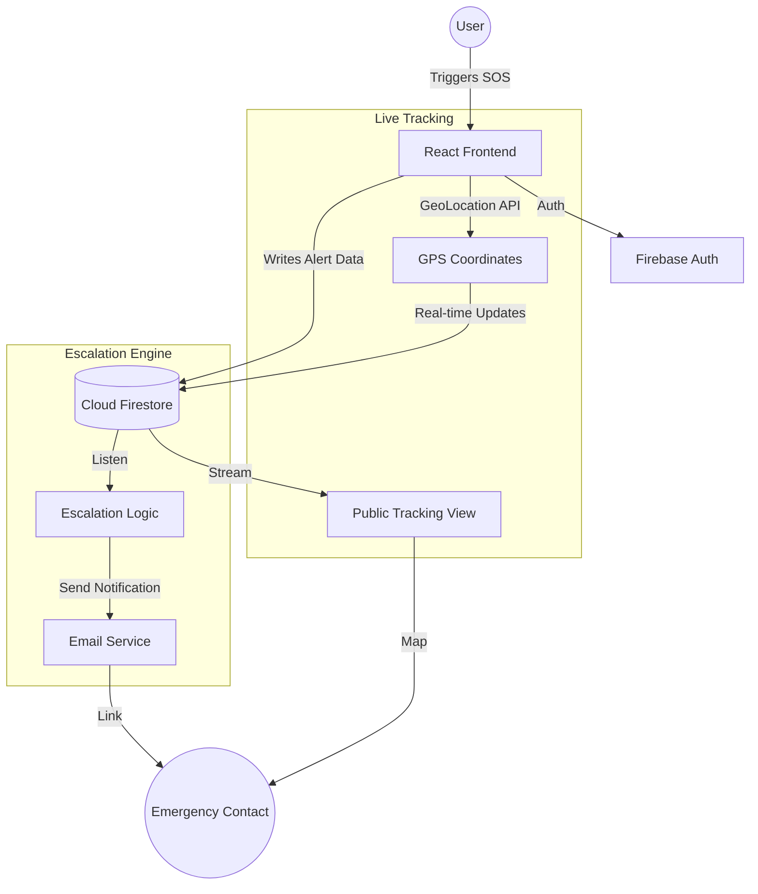
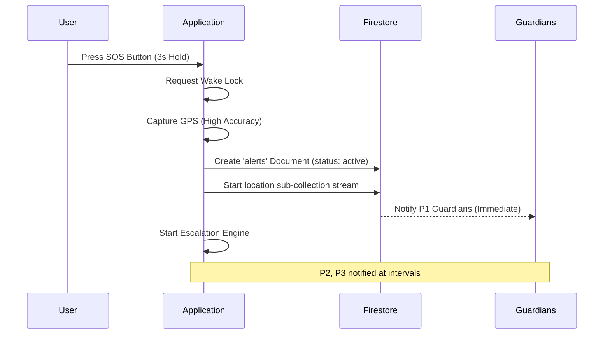
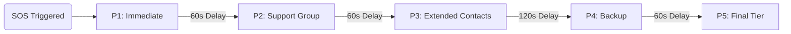
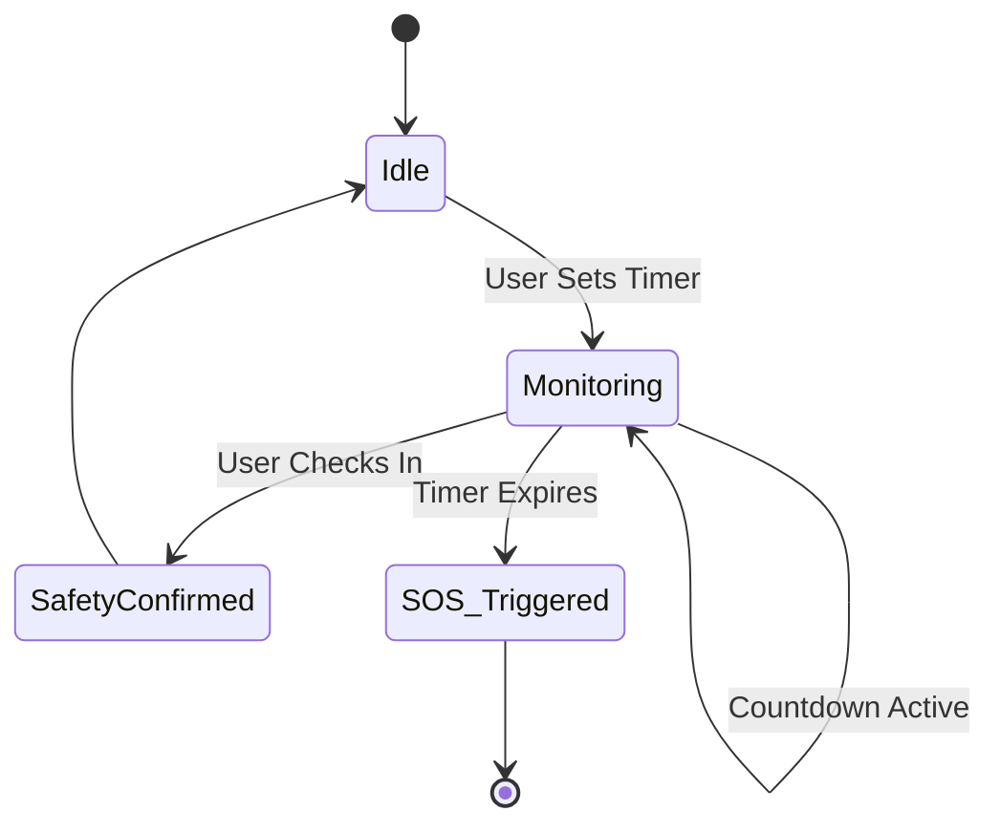

# GuardianOS 🛡️
### Personal Safety & SOS Emergency Response System

GuardianOS is a mission-critical personal safety application designed to provide immediate assistance during emergencies. By integrating real-time GPS tracking, multi-level contact escalation, and automated safety check-ins, GuardianOS ensures that help is always just a tap away.

---

## 🚀 Core Features

### 🆘 Instant SOS Protocol
One-tap activation that immediately captures high-accuracy GPS coordinates and starts a live-tracking session.
- **High-Accuracy Tracking**: Continuous location updates pushed to Firestore.
- **Wake Lock Integration**: Prevents the device from sleeping during an active emergency.
- **Live Dashboard**: Real-time map view for emergency contacts.

### 📶 Intelligent Escalation Engine
A sophisticated notification system that alerts contacts based on predefined priority levels (P1-P5).
- **Staged Alerts**: P1 contacts are notified instantly, followed by successive groups at timed intervals (60s, 120s, etc.).
- **Smart Delays**: Configurable timing ensures the right people are reached at the right time.
- **Multi-Channel**: Supports email notifications with direct tracking links.

### ⏲️ Safety Registry (Check-In)
Automated "pulse check" protocol for high-risk situations (e.g., walking home alone).
- **Custom Windows**: Set safety timers from 15 minutes to 24 hours.
- **Auto-Trigger**: If the user fails to confirm safety before the timer expires, an SOS alert is automatically initiated.
- **Visual Feedback**: Dynamic glow effects and countdowns indicate system status.

---

## 🏗️ System Architecture

GuardianOS leverages a modern, serverless architecture for maximum reliability and low latency.



---

## 🔄 Workflow Logic

### 1. SOS Activation Flow


### 2. Escalation Logic (P1-P5)


### 3. Safety Registry Loop


---

## 🛠️ Technology Stack

- **Frontend**: [React 18](https://reactjs.org/) + [TypeScript](https://www.typescriptlang.org/)
- **Build Tool**: [Vite](https://vitejs.dev/)
- **Styling**: Vanilla CSS (Modern Design System)
- **Database & Auth**: [Firebase](https://firebase.google.com/) (Firestore, Authentication)
- **APIs**: Web Geolocation API, Screen Wake Lock API, Google Maps API
---

## ⚙️ Setup & Installation

### Prerequisites
- Node.js 18+
- Firebase Project

### 1. Clone & Install
```bash
git clone <repository-url>
cd sos-alert-app
npm install
```

### 2. Environment Configuration
Create a `.env` file in the root directory:
```env
VITE_FIREBASE_API_KEY=your_key
VITE_FIREBASE_AUTH_DOMAIN=your_domain
VITE_FIREBASE_PROJECT_ID=your_id
VITE_FIREBASE_STORAGE_BUCKET=your_bucket
VITE_FIREBASE_MESSAGING_SENDER_ID=your_sender_id
VITE_FIREBASE_APP_ID=your_app_id
VITE_GOOGLE_MAPS_API_KEY=your_google_maps_key
```

### 3. Run Locally
```bash
npm run dev
```

---

## 📁 Project Structure

```text
src/
├── components/   # Reusable UI elements
├── hooks/        # Custom React hooks (useAuth, etc.)
├── lib/          # Utilities and configurations
├── pages/        # Main application views (Dashboard, SOS, Tracking)
├── services/     # Logic for SOS, Escalation, and Firebase
└── types/        # TypeScript definitions
```

---

## 🛡️ Security & Privacy
GuardianOS is built with privacy in mind. Location tracking is **only** active during an SOS event or a pending Safety Registry session. All data is secured via Firebase Security Rules.

---
*Developed with focus on reliability and speed. Stay safe.*
